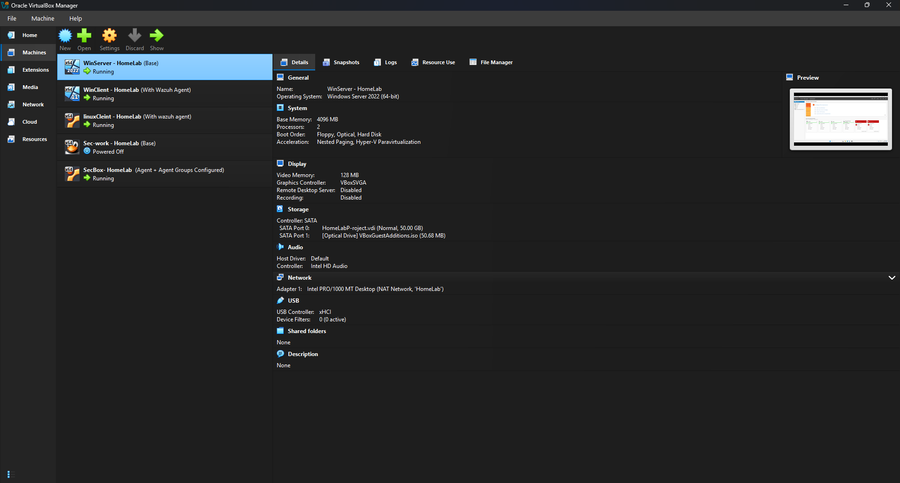

# 🚀 Cybersecurity Homelab – SIEM & Active Directory Setup  

## 📌 Overview  
This project is a self-built cybersecurity homelab that simulates an enterprise environment. It was designed to gain hands-on experience with networking, system administration, and security monitoring.  

The lab consists of:  
- **Windows Server 2022** (Active Directory Domain Controller)  
- **Windows 10 Enterprise client**  
- **Ubuntu server**  
- **Wazuh SIEM** (for log collection and analysis)

- **Network Setup:**  
- All machines are connected to a virtual NAT/internal network (`10.0.0.x/24`).  
- Each machine has a **static IP** for consistency and communication.  

| Machine              | Role                                | IP Address   |  
|-----------------------|-------------------------------------|--------------|  
| Windows Server 2022   | Domain Controller (AD, DNS)         | 10.0.0.5     |  
| Windows 10 Enterprise | Domain-joined client                | 10.0.0.100   |  
| Ubuntu Server         | Domain-joined client / log source   | 10.0.0.101   |  
| Wazuh Server          | SIEM (log collection & monitoring)  | 10.0.0.10    |  

## ⚙️ Setup Highlights  
- Configured **Active Directory** with domain-joined Windows & Ubuntu machines.  
- Set **static IP addresses** for all VMs to ensure reliable network connectivity.  
- Installed and integrated **Wazuh SIEM**, collecting logs from Windows Server, Windows 10 Enterprise, and Ubuntu endpoints.  
- Simulated a small enterprise environment for **SOC-style monitoring and detection practice**.

## 📊 Screenshots  
**VM's**
   
